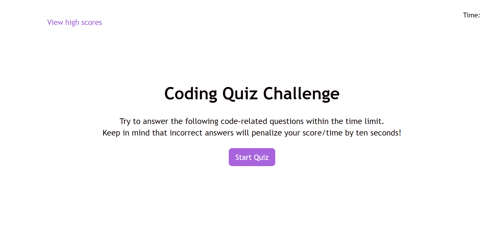

# coding-bootcamp-student-quiz

## Description

This repository constains code (HTML, CSS, and JavaScript) for a website that provide users with an interactive quiz to test their knowledge of Javascript basics. A user is alotted 200 seconds to complte ten questions in a multiple choice format with the user being presented one questin at a time. With every question answered, a prompt is displayed to the screen indicating whether the question was answered correctly or incorrectly. A correct answer earns the user five points while an incorrect answer reduces the users score by one point and the time remaining by ten seconds. Upon completion of the quiz (by all questions answered or the timer running out) the user is presented with a form where they can enter their initials to save their score. Users may return to the home screen where they may take the quiz again or view previous scores.

I found working with local storage, specifically stringifying objects, to be the most diffcult aspect of this project. I recognize after this project that I could still benefit from additional work that involves setting and getting items from local storage that must be first converted to strings and then later parsed in order to work with them in JavaScript. 

## Installation

N/A

## Usage

## Credits

I utilized documentation from both W3Schools and Modzilla while working on this project. Specifically I referenced documentation covering localStorage while working on the code regarding saving and recalling high scores. I also heavily referenced documentation from these platforms covering setInterval, and clearInterval functions while working with the timer of this quiz.  

## Links

https://sambrez.github.io/coding-bootcamp-student-quiz/